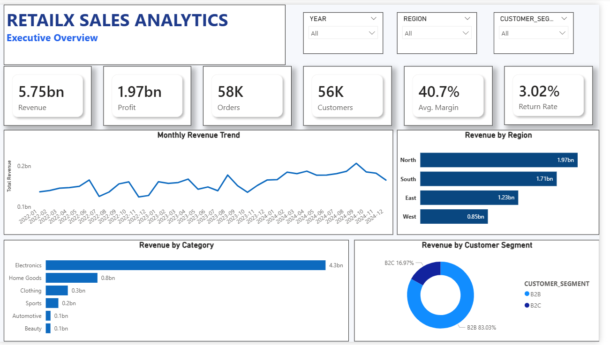

# 🚀 RetailX Cloud Sales Analytics Pipeline

> End-to-end cloud analytics pipeline built with **PySpark, Snowflake, Python, and Power BI** for automated sales data ingestion, transformation, warehouse loading, and interactive business reporting.



---

# 📌 Project Overview

Retail organizations receive sales data continuously from multiple branches and regions. Manual data preparation and reporting become slow, error-prone, and difficult to scale.

This project simulates a production-grade analytics pipeline that automatically:

- Generates monthly retail sales datasets
- Cleans and validates data using PySpark
- Loads data into Snowflake using internal stages
- Maintains pipeline execution logs
- Builds analytical views
- Powers an interactive Power BI dashboard

The entire workflow demonstrates how modern cloud data pipelines are designed for scalable analytics.

---

# 🏗 Architecture

```
                Monthly Sales CSV Files
                         │
                         ▼
               Python Data Generator
                         │
                         ▼
                 PySpark ETL Pipeline
          • Validation
          • Data Cleaning
          • Currency Parsing
          • Duplicate Removal
          • Business Rule Checks
                         │
                         ▼
              Snowflake Internal Stage
                 (PUT Command)
                         │
                         ▼
               COPY INTO RAW_TRANSACTIONS
                         │
        ┌────────────────┴───────────────┐
        │                                │
        ▼                                ▼
 PIPELINE_LOG                   Analytics Views
        │                                │
        └────────────────┬───────────────┘
                         ▼
                 Power BI Dashboard
```

---

# ⚙️ Technology Stack

| Category | Technologies |
|----------|--------------|
| Language | Python |
| Data Processing | PySpark |
| Data Warehouse | Snowflake |
| Dashboard | Power BI |
| Data Generation | Faker, NumPy, Pandas |
| Cloud Loading | Snowflake PUT & COPY INTO |
| Version Control | Git & GitHub |

---

# 📂 Project Structure

```
retailx-snowflake-etl-pipeline
│
├── config/
├── data/
│   ├── archive/
│   ├── monthly_drops/
│   └── processed/
│
├── snowflake/
│   ├── 01_setup.sql
│   ├── 02_internal_stage.sql
│   ├── 03_task.sql
│   ├── 04_views.sql
│   └── 05_queries.sql
│
├── src/
│   ├── data_generator.py
│   ├── pipeline_runner.py
│   ├── pyspark_transform.py
│   ├── snowflake_loader.py
│   └── config.py
│
├── docs/
│   └── dashboard.png
│
├── requirements.txt
├── README.md
└── .gitignore
```

---

# 🔄 Pipeline Workflow

### 1. Synthetic Data Generation

- Generates 36 monthly retail sales datasets
- Simulates over **57,000 sales transactions**
- Includes customers, products, regions, discounts, targets, and returns

---

### 2. PySpark ETL

The pipeline performs:

- Schema validation
- Duplicate removal
- Currency normalization
- Date parsing
- Null handling
- Business-rule validation
- Feature engineering

---

### 3. Snowflake Loading

Processed files are:

- Uploaded using **PUT**
- Loaded using **COPY INTO**
- Stored in `RAW_TRANSACTIONS`
- Logged into `PIPELINE_LOG`

The pipeline prevents duplicate processing by checking previously ingested files.

---

### 4. Analytics Layer

Snowflake Views provide curated datasets for reporting:

- Clean Transactions
- Monthly Summary
- Salesperson Performance
- Pipeline Monitoring

---

### 5. Power BI Dashboard

Two interactive dashboard pages were built:

### 📊 Executive Overview

- Revenue KPIs
- Profit KPIs
- Customer Metrics
- Revenue Trend
- Regional Performance
- Product Category Analysis
- Customer Segment Distribution

### ⚙ Pipeline Health

- Pipeline Run Metrics
- Success Rate
- Rows Loaded
- Rows Rejected
- File Processing Distribution
- Pipeline Execution Logs

---

# ✨ Key Features

- Automated ETL pipeline
- Incremental monthly ingestion
- Duplicate file detection
- Data quality validation
- Snowflake internal stage loading
- Automated analytics refresh
- Interactive Power BI dashboards
- Pipeline health monitoring
- Production-style project structure

---

# 📈 Dashboard Preview


---

# 📊 Results

- Generated **57,600+ retail sales records**
- Processed **36 monthly datasets**
- Built an automated cloud ETL pipeline
- Loaded cleaned data into Snowflake
- Designed reusable analytical views
- Developed an executive Power BI dashboard
- Implemented operational pipeline monitoring

---

# ▶️ How to Run

### Clone Repository

```bash
git clone https://github.com/Ankit-Dubey10/retailx-snowflake-etl-pipeline.git
```

---

### Install Dependencies

```bash
pip install -r requirements.txt
```

---

### Configure Snowflake

Create a `.env` file with:

```env
SNOWFLAKE_ACCOUNT=
SNOWFLAKE_USER=
SNOWFLAKE_PASSWORD=
SNOWFLAKE_WAREHOUSE=
SNOWFLAKE_DATABASE=
SNOWFLAKE_SCHEMA=
SNOWFLAKE_ROLE=
```

---

### Generate Data

```bash
python src/data_generator.py
```

---

### Run the Pipeline

```bash
python src/pipeline_runner.py
```

---

### Open Dashboard

Open the included Power BI file and refresh the data source.

---

# 🚀 Future Improvements

- Real-time streaming with Kafka
- Apache Airflow orchestration
- Docker containerization
- CI/CD using GitHub Actions
- Automated Power BI Service refresh
- Data quality alerts
- Cloud deployment on AWS or Azure

---

# 👨‍💻 Author

**Ankit Dubey**

- GitHub: https://github.com/Ankit-Dubey10
- LinkedIn: *(Add your LinkedIn profile here)*

---

⭐ If you found this project interesting, consider giving the repository a star.
